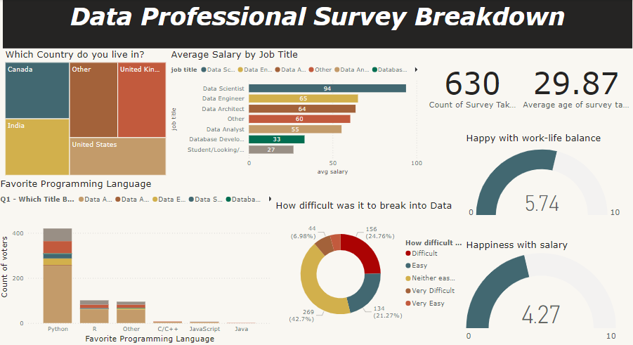

# Data Professional Survey Breakdown - Power BI Dashboard

## Overview 📊

This Power BI dashboard provides a comprehensive breakdown of a survey conducted among data professionals, showcasing key metrics related to demographics, job titles, salary information, and professional satisfaction. The project aims to offer insights into the current landscape of the data profession.

## Dataset and Data Cleaning 🗃️

The dataset used for this project contains responses from 630 survey participants. Some cleaning and transformation were performed in Power BI to ensure accurate visualizations.

## Dashboard Visualizations 📈

The dashboard contains the following visualizations:

1. **Geographic Distribution of Participants (Tree Map)** 🌍:
   - Shows the distribution of survey participants across countries.

2. **Average Salary by Job Title (Bar Chart)** 💰:
   - A comparison of average salaries for different job titles, with Data Scientists reporting the highest average salary.

3. **Favorite Programming Language (Stacked Bar Chart)** 🐍:
   - A breakdown of the most popular programming languages among data professionals, with Python leading.

4. **Challenges Breaking into Data (Pie Chart)** 📉:
   - Participants' responses on the difficulty of entering the data industry.

5. **Work-Life Balance and Salary Satisfaction (Gauge Charts)** ⚖️:
   - Visualizations showing average satisfaction levels with work-life balance and salary.

## Excel Data File 📂

The original Excel file containing the survey data can be found on GitHub at the following link:

- [Power BI - Final Project Excel File](https://github.com/Miinhaz/PowerBI-project1/blob/main/Power%20BI%20-%20Final%20Project.xlsx)

## Usage Instructions 🔧

1. **Power BI File**: Load the Power BI file containing the cleaned data and dashboard visuals.
   
2. **Interact with the Dashboard**: Filter the visualizations by different categories for specific insights.

3. **Customization**: Modify the visuals and incorporate additional fields for more detailed analysis.

## Conclusion 🎉

This dashboard provides an in-depth look into the landscape of the data profession, offering useful insights into salary trends, programming language preferences, and professional satisfaction.

